# niv

[](https://github.com/nmattia/niv/actions/workflows/test.yml)
[](https://niv.nmattia.com)

Painless dependencies for [Nix] projects. Read more in the [Getting started](#getting-started) section below.

<p align="center">
    
</p>


* [Install](#install)
* [Build](#build)
* [Usage](#usage)
* [FAQ](#frequently-asked-questions)

## Install

`niv` is available in [`nixpkgs`](https://github.com/NixOS/nixpkgs) as `niv`:

``` bash
$ nix-env -iA nixpkgs.niv
```

Alternatively, run the following command to install the development version:

``` bash
$ nix-env -iA niv -f https://github.com/nmattia/niv/tarball/master \
    --substituters https://niv.cachix.org \
    --trusted-public-keys niv.cachix.org-1:X32PCg2e/zAm3/uD1ScqW2z/K0LtDyNV7RdaxIuLgQM=
```

## Build

Inside the provided nix shell:

``` bash
$ repl
```

Run the test suite with this command:

``` bash
$ ./script/test
```

## Usage

`niv` simplifies [adding](#add) and [updating](#update) dependencies in Nix
projects. It uses a single file, `nix/sources.json`, where it stores the data
necessary for fetching and updating the packages.

* [Add](#add): inserts a package in `nix/sources.json`.
* [Update](#update): updates one or all packages in `nix/sources.json`.
* [Drop](#drop): deletes a package from `nix/sources.json`.

`niv` has some utility functions:

* [Init](#init): bootstraps a Nix project, in particular creates a
  `nix/sources.json` file containing `niv` and `nixpkgs` as well as a
  `nix/sources.nix` file that returns the sources as a Nix object.
* [Show](#show): shows the packages' information.
* [Modify](#modify): modifies attributes _without_ performing an update.

### Configuration

The following environment variables are read by `niv`:

| Name            | Note |
| --------------- | ---- |
| GITHUB_TOKEN or NIV_GITHUB_TOKEN | When set, the value is used to authenticate GitHub API requests. |
| GITHUB_HOST or NIV_GITHUB_HOST | The GitHub host to use when fetching packages. Port may be appended here. |
| GITHUB_API_HOST or NIV_GITHUB_API_HOST | The host used when performing GitHub API requests. Use `GITHUB_API_PORT` for specifying the port. |
| GITHUB_API_PORT or NIV_GITHUB_API_PORT | The port used when performing GitHub API requests. Defaults to `443` for secure requests. Defaults to `80` for insecure requests. See also: `GITHUB_INSECURE`. |
| NIV_GITHUB_INSECURE | When set to anything but the empty string, requests are performed over `http` instead of `https`. |
| NIV_GITHUB_PATH     | The base path used when performing GitHub API requests. |

The next two sections cover [common use cases](#getting-started) and [full command
description](#commands).

### Getting started

Nix is a very powerful tool for building code and setting up environments. `niv` complements it by making it easy to describe and update remote dependencies (URLs, GitHub repos, etc). It is a simple, practical alternative to [Nix flakes](https://wiki.nixos.org/wiki/Flakes).

This section covers common use cases:

* [Bootstrapping a Nix project](#bootstrapping-a-nix-project).
* [Tracking a different nixpkgs branch](#tracking-a-nixpkgs-branch).
* [Importing packages from GitHub](#importing-packages-from-github).
* [Fetching packages from custom URLs](#using-custom-urls).

#### Bootstrapping a Nix project

Use the `init` command when starting a new Nix project or when porting an
existing Nix project to niv:

``` shell
$ niv init
...
$ tree
.
└── nix
    ├── sources.json
    └── sources.nix

1 directory, 2 files
```

The file `nix/sources.json` is the file used by niv to store versions and is
initialized with nixpkgs:

``` json
{
    "nixpkgs": {
        "branch": "nixos-unstable",
        "description": "Nix Packages collection",
        "homepage": null,
        "owner": "NixOS",
        "repo": "nixpkgs",
        "rev": "6c43a3495a11e261e5f41e5d7eda2d71dae1b2fe",
        "sha256": "16f329z831bq7l3wn1dfvbkh95l2gcggdwn6rk3cisdmv2aa3189",
        "type": "tarball",
        "url": "https://github.com/NixOS/nixpkgs/archive/6c43a3495a11e261e5f41e5d7eda2d71dae1b2fe.tar.gz",
        "url_template": "https://github.com/<owner>/<repo>/archive/<rev>.tar.gz"
    }
}
```

To use this dependency, `import` the file `nix/sources.nix`, e.g.:

``` nix
{ sources ? import ./sources.nix }:     # import the sources
import sources.nixpkgs                  # and use them again!
  { overlays = [] ; config = {}; }
```

For more information about importing sources to your nix files, check
the [frequently asked questions](#Frequently-asked-questions).

#### Tracking a nixpkgs branch

The `init` command sets the `nix/sources.json` to the content of the file
[data/nixpkgs.json](data/nixpkgs.json). Currently, you would be tracking the
`nixos-unstable` branch.
Run the following command to
update it to the last commit of the configured branch:

``` shell
$ niv update nixpkgs
```

To change the branch being tracked run this command:

``` shell
$ niv update nixpkgs -b master     # equivalent to --branch master
```

#### Importing packages from GitHub

The `add` command will infer information about the package being added, when
possible. This works very well for GitHub repositories. Run this command to add
[jq] to your project:


``` shell
$ niv add stedolan/jq
```

The following data was added in `nix/sources.json` for `jq`:

``` json
{
  "homepage": "http://stedolan.github.io/jq/",
  "url": "https://github.com/stedolan/jq/archive/9fa2e51099c55af56e3e541dc4b399f11de74abe.tar.gz",
  "owner": "stedolan",
  "branch": "master",
  "url_template": "https://github.com/<owner>/<repo>/archive/<rev>.tar.gz",
  "repo": "jq",
  "sha256": "0819rvk8057qgcqvgn7fpldvly2pfdw9fxcjrlqa8gr59p8a1cic",
  "description": "Command-line JSON processor",
  "rev": "9fa2e51099c55af56e3e541dc4b399f11de74abe"
}
```

#### Using custom URLs

It is possible to use niv to fetch packages from custom URLs. Run this command
to add the Haskell compiler [GHC] to your `nix/sources.json`:

``` shell
$ niv add ghc   \
    -v 8.4.3    \
    -t 'https://downloads.haskell.org/~ghc/<version>/ghc-<version>-i386-deb8-linux.tar.xz'
```

The option `-v` sets the "version" attribute to `8.4.3`. The option `-t` sets a
template that can be reused by niv when fetching a new URL (see the
documentation for [add](#add) and [update](#update)).

The type of the dependency is guessed from the provided URL template, if `-T`
is not specified.

For updating the version of GHC used run this command:

``` shell
$ niv update ghc -v 8.6.2
```

### Commands

```
replace_niv_help
```

#### Add

```
replace_niv_add_help
```

#### Update

```
replace_niv_update_help
```

#### Modify

```
replace_niv_modify_help
```

#### Drop

```
replace_niv_drop_help
```

#### Init

```
replace_niv_init_help
```

#### show

```
replace_niv_show_help
```

[Nix]: https://nixos.org/nix/
[jq]: https://stedolan.github.io/jq/
[GHC]: https://www.haskell.org/ghc/


## Frequently Asked Questions

* [Can I use private GitHub repositories?](#can-i-use-private-github-repositories)
* [How do I import and use the content of a source?](#how-do-i-import-and-use-the-content-of-a-source)
* [How do I import a subpath of a source?](#how-do-i-import-a-subpath-of-a-source)
* [How do I import NixOS modules](#how-do-i-import-nixos-modules)
* [Can I use local packages?](#can-i-use-local-packages)
* [Can I use git submodules?](#can-i-use-git-submodules)

### Can I use private GitHub repositories?

Yes. There are two ways:

#### 1. Use the git protocol

When using the git protocol, your public SSH keypair is used to authenticate
you:

``` shell
$ niv add git git@github.com:my_user/my_private_repo
```

##### 2. Use the netrc file

in order to `niv add` a private github repo you'll need to:

1. create a .netrc file with the following content
```
machine github.com
  login YOUR_GITHUB_USER_NAME
  password YOUR_GITHUB_TOKEN
```

2. add the path to the above file to `/etc/nix/nix.conf`:
```
netrc-file = /PATH/TO/.netrc
```

3. set `GITHUB_TOKEN` env var when calling `niv add`
```
GITHUB_TOKEN=$YOUR_GITHUB_TOKEN niv add ...
```

### How do I import and use the content of a source?

The way to import a source depend mainly on the content targetted by this
source. A source could be a file, a repository with no knowledge of nix
or a repository already in the nix ecosystem.

#### 1. Direct import of a nix based source

In the case of a nix based source, you'll often find a `default.nix`  at the
root. Let's take this repository as example. We can add it to our `sources.json`
with the following command.

``` shell
$ niv add nmattia/niv
```

We can now import niv to use it a nix expression, e.g.:

``` nix
{ sources ? import nix/sources.nix }:
let niv = import sources.niv {};
in { inherit niv; } # A glorious expression using the reference to niv
```

#### 2. Import of a nix based source via an overlay

Rather than use the resulting derivation directly, you can add it to your custom 
nixpkgs via the overlay system.

``` nix
{ sources ? import nix/sources.nix}:
let overlay = _: pkgs: {
      niv = (import sources.niv {}).niv;
    };
    nixpkgs = import sources.nixpkgs { overlays = [ overlay ]; config = {}; };
in { inherit (nixpkgs) niv; } # A glorious expression where nixpkgs.niv is referenced
```

#### 3. Reference to the source's files in the nix store

You can also reference a simple file, a folder or a repo without nix knowledge
with niv. In these cases, you can use the source in your nix expression without
importing it.

The following exemple will compile gnu hello while using this technique to retrieve
the source. First, we need to add the new source.

``` shell
$ niv add hello-src -v 2.10 -t 'https://ftp.gnu.org/gnu/hello/hello-<version>.tar.gz'
```

Then, we can use it inside a nix expression.

``` nix
{ sources ? import nix/sources.nix }:
let hello_src = sources.hello-src;
    nixpkgs =  import sources.nixpkgs {};
in nixpkgs.stdenv.mkDerivation {
    pname = "hello";
    version = "custom";
    src = hello_src;
}
```

:warning: If you have problems, consider using the outPath of the source
(e.g. `sources.hello-src.outPath`) instead of the source directly. See 
[this issue](https://github.com/nmattia/niv/issues/325) for more details.

### How do I import a subpath of a source?

In order to use the directory `dir` of a `my-package`, use the following
pattern:

``` nix
let
  sources = import ./nix/sources.nix;
in sources.my-package + "/dir"
```

in this example, `sources.my-package` becomes `my-package`'s root directory, and `+ "/dir"` appends the
subdirectory.

### How do I import NixOS modules?

After the package containing the modules has been `niv add`ed, importing the
modules is straightforward:

``` nix
let
  sources = import ./nix/sources.nix;
in {
  imports = [ (sources.package + "/path/to/module") ];
}
```

### Can I use local packages?

If you need to use a local path as a source -- especially convenient when
modifying dependencies -- `niv` allows you to override the `sources.json` via
environment variables. To override a source `foo` with a local path
`./bar/baz`, set the environment variable `NIV_OVERRIDE_foo` to `./bar/baz`.

Generally, if the environment variable `NIV_OVERRIDE_<name>` is set _and_ you
have a source named `<name>` then `niv` will use the value of
`NIV_OVERRIDE_<name>` as the `outPath` of that source. All non-alphanumeric
characters in the source name are escaped to the character `_`; i.e. to
override the package `my package-foo` you need to set the environment variable
`NIV_OVERRIDE_my_package_foo`.

### Can I use a git dependency with submodules?

Yes, however you need to follow some steps.

Add your dependency as git dependency to your `sources.json`:
```
niv add git git@github.com:user/repo -n name
```

Add `"submodules": true,` to your dependecy in the source.json:
```
{
    "name": {
        "branch": "main",
        "repo": "git@github.com:user/repo",
        "rev": "XXXXXXXXXXXXXXXXXXXXXXXXXXXXXXXXXXXXXXXX",
        "submodules": true,
        "type": "git"
    }
}
```
